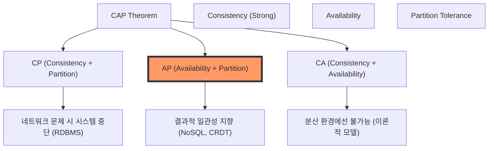
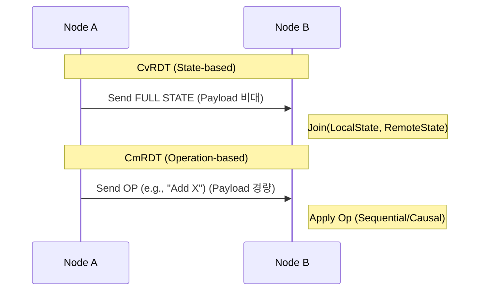
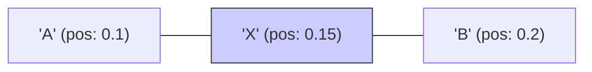

# CRDT (Conflict-free Replicated Data Type)
## 1. 분산 시스템의 데이터 일관성
- **시대적 배경**: 단일 데이터베이스 서버의 물리적 한계 돌파 및 전 세계 사용자 대상 저지연 서비스(Low-latency) 제공을 위한 노드 간 데이터 복제(Replication) 필수임.
- **CAP 정리와 현실적 타협**:
    - **Consistency (일관성)**: 모든 노드가 항상 동일 데이터 보유.
    - **Availability (가용성)**: 일부 장애 시에도 응답 보장.
    - **Partition Tolerance (분할 내성)**: 네트워크 단절 시에도 시스템이 동작해야 함.


- **전통적 충돌 해결의 지옥 (Conflict Resolution Hell)**:
    - **LWW (Last Write Wins)**: 단순히 타임스탬프 늦은 쪽 승리. 0.001초 차이로 공들인 수정사항이 증발하는 '데이터 유실'의 온상임.
    - **Manual Merging**: "어떤 버전을 선택하시겠습니까?" 팝업. 사용자 경험(UX) 최악. 실시간 협업 툴(피그마, 문서 편집기)에선 적용 절대 불가함.
    - **Vector Clocks / Version Vectors**: 데이터 선후 관계(Causality)는 기막히게 잡아내지만, "어떻게 합칠지" 정답은 안 알려줌. 결국 개발자가 직접 복잡한 Merge logic 설계해야 함.
- **핵심 통찰**: 아예 **수학적으로 충돌이 발생할 수 없는 구조**를 데이터 타입 수준에서 설계하자 → **CRDT** 탄생 배경임.

---

## 2. CRDT의 수학적 정의 및 핵심 속성
- **정의**: 명시적 합의(Consensus, 예: Raft/Paxos) 없이 업데이트만 주고받아도 모든 노드가 결국 동일한 상태에 도달함을 보장함.
- **SEC (Strong Eventual Consistency) 보장**:
    - 일반적 최종 일관성보다 상위 개념. 
    - "동일 업데이트 세트를 받은 노드들은 **수신 순서 상관없이 그 즉시** 동일 상태임"을 수학적으로 확약함.
    - 백그라운드 합의 과정 없이 로컬 연산만으로 진실(Truth) 확정 가능.
- **수학적 엔진: 반격자 (Join Semi-lattice)**:
    - 데이터 상태 집합 $S$와 순서 관계 $\le$가 있을 때 아래 3가지 속성 만족 필수임.

| 속성                        | 수학적 표현                                          | 실제 의미 (개인 메모용)                 |
| :------------------------ | :---------------------------------------------- | :----------------------------- |
| **Associativity (결합 법칙)** | $(a \sqcup b) \sqcup c = a \sqcup (b \sqcup c)$ | 업데이트 묶는 순서 상관없음                |
| **Commutativity (교환 법칙)** | $a \sqcup b = b \sqcup a$                       | 업데이트 도착 순서 상관없음 (패킷 순서 뒤바뀜 해결) |
| **Idempotency (멱등성)**     | $a \sqcup a = a$                                | 동일 업데이트 중복 도착 상관없음 (재전송 오류 해결) |

- **$\sqcup$ (Join 연산)**: 두 상태를 합쳐 둘 다 포함하는 최소 상한(Least Upper Bound) 생성. (합집합, 최댓값 등)

---

## 3. 구현 방식별 심층 비교: CvRDT vs CmRDT



### 3-1. CvRDT (State-based CRDTs)
- **메커니즘**: 자신의 전체 **상태(State)** 전송.
- **병합**: 수신 측에서 `Merge(MyState, ReceivedState)` 수행.
- **장점**: 
    - 네트워크 유실에 강함. 이전 패킷 놓쳐도 최신 패킷에 모든 상태 담겨있어 복구 쉬움.
    - 인프라 요구사항 매우 낮음 (Best-effort 전달이면 OK).
- **단점**: 
    - 상태가 커질수록 네트워크 트래픽 폭증. 
    - **해결책**: 변경된 델타(Delta)만 모아서 보내는 **Delta-state CRDT**가 주로 쓰임.

### 3-2. CmRDT (Operation-based CRDTs)
- **메커니즘**: 데이터 자체가 아닌 **연산(Operation)**만 전송.
- **병합**: 수신 측에서 연산을 자신의 상태에 즉각 적용.
- **장점**: 페이로드가 극히 작아 대역폭 효율적임.
- **단점**: 
    - **인과적 순서 보장(Causal Delivery)** 필수. (예: '추가'가 처리되기 전에 '삭제'가 먼저 일어나면 논리적 오류 발생)
    - 메시지 큐 등 인프라 수준에서의 신뢰성 보장 로직 필요.

---

## 4. 데이터 구조별 상세 알고리즘 & 시나리오

### 4-1. 카운터 (Counters)
#### G-Counter (Grow-only Counter)
- 증가만 가능. 벡터 `P` 유지. (각 노드는 자신의 인덱스만 수정)
```python
class GCounter:
    def __init__(self, node_id, num_nodes):
        self.node_id = node_id
        self.P = [0] * num_nodes
    def increment(self): self.P[self.node_id] += 1
    def value(self): return sum(self.P)
    def merge(self, other):
        for i in range(len(self.P)): self.P[i] = max(self.P[i], other.P[i])
```
#### PN-Counter (Positive-Negative Counter)
- 증가 전용 $P$, 감소 전용 $N$ 두 개의 G-Counter 합체.
- **Value**: $P.value() - N.value()$

### 4-2. 집합 (Sets)
#### 2P-Set (Two-Phase Set)
- 추가 집합($A$), 삭제 집합($R$) 관리. 삭제 시 $R$로 이동. 재추가 불가.
#### OR-Set (Observed-Remove Set)
- 원소마다 UUID 태그 부여. 삭제 시 눈에 보이는 태그만 삭제 목록에 추가하여 재추가 지원.

---

## 5. 시퀀스 (Sequence / List) - 협업의 심장부
#### Fractional Indexing (분수형 인덱스)
- 문자와 문자 사이 무한 개입 가능한 실수 주소 부여.
- **LSEQ**: 트리 구조 주소 공간 전략. 삽입 패턴이 집중되어도 주소 비트 폭발을 막음.
- **RGA**: 인과적 연결 리스트. 삭제 시 Tombstone 활용. 문맥 보존 능력 최상임.



---

## 6. OT (Operational Transformation)
- **철학**: 도착한 연산을 내 상황에 맞게 변형하여 적용함 (구글 독스 방식).

### 6-1. OT의 치명적 한계
- **서버 의존성**: 연산 순서 확정용 **중앙 서버** 필수 (P2P 불가).
- **복잡도 폭발**: 연산 종류가 늘어날수록 변형 함수(Transformation Function) 증명이 지옥임.

### 6-2. CRDT vs OT 비교 결정판
| 비교 포인트 | Operational Transformation (OT) | Conflict-free Replicated Data Type (CRDT) |
| :--- | :--- | :--- |
| **방식** | 연산 변형 중심 | 데이터 구조 자체로 승부 |
| **네트워크** | 중앙 집중형 (C/S) | 완전 분산형 (P2P/Cloud) |
| **확장성** | 서버 부하 큼 | 분산 확장 용이 |
| **데이터량** | 극히 적음 | 많음 (ID, 톰스톤 등) |

---

## 7. 백엔드 서버 환경에서의 활용 전략

### 7-1. Multi-region 글로벌 인프라
- 리전 간 데이터 비동기 동기화 시 멱등성 보장. 글로벌 정합성 확보에 최적임.
- **예**: 글로벌 회원 포인트 관리, 다국적 재고 동기화.

### 7-2. 고성능 Write Scalability (Lock-free)
- 분산 락 비용 없이 서버 간 독립적 쓰기 가능.
- **예**: 실시간 조회수 집계, Rate Limiter, 분산 세션 카운트.

### 7-3. MSA 이벤트 기반 동기화 (EDA)
- 메시지 큐 순서 뒤섞여도 정합성 확보 가능함. 'At-least-once'로 'Exactly-once' 효과 창출.

---

## 8. Advanced Expert Topics

### 8-1. Byzantine Fault Tolerance (BFT) CRDT
- 악성 노드의 데이터 조작 방어. 연산에 개인키 서명 및 해시 체인 결합하여 무결성 보장함.

### 8-2. Metadata Pruning (가지치기) 상세
- **Tombstone 해결**: 모든 노드가 특정 시점 상태를 공유했음을 확인하면(Stable point), 이전 톰스톤을 일괄 폐기하여 메모리 확보함. 이를 위해 Gossip 프로토콜이나 벡터 클릭을 이용한 합의가 수반됨.

### 8-3. Undo / Redo의 구현 상세
- 기존 연산을 상쇄하는 **'상상 연산(Inversion)'** 생성 및 전파. 
- 복원 시에도 인과적 이력(Causal History)을 보존하여 다른 사용자의 동시 편집을 해치지 않아야 함.

### 8-4. CRDT 구현 시 안티 패턴 (Anti-patterns)
1. **Unbounded Metadata**: 톰스톤 관리 없이 무한히 데이터를 쌓는 행위 -> 메모리 리크 주범.
2. **Ignoring Causality**: CmRDT에서 인과적 순서 보장 없는 전송 계층 사용 -> 데이터 오염.
3. **Heavy State Transfer**: 델타 동기화 없이 전체 상태를 주기적으로 보내는 설계 -> 네트워크 마비.

### 8-5. 성능 최적화 및 벤치마크 기법
- **Binary Encoding**: JSON 대신 바이너리 포맷(Protobuf, msgpack)이나 Yjs 전용 인코딩 사용.
- **Chunking**: 시퀀스 데이터를 적절한 크기로 쪼개어 부분적 병합 수행.
- **Structural Sharing**: 불변 객체 패턴을 사용하여 메모리 사용 최적화.

---

## 9. 엔터프라이즈급 실전 활용 사례 (Case Studies)

1. **글로벌 재고 관리 시스템**: 전 세계 100개국 리전의 재고를 0.1초 이내로 업데이트하며 한정판 판매 시 오버셀 방지 (Hybrid CRDT 활용).
2. **분산 속도 제한기 (Rate Limiter)**: 초당 수백만 건의 API 요청을 여러 리전에서 수집하여 사용자당 할당량을 정확히 체크.
3. **실시간 위성 추적 데이터 통합**: 수천 개의 위성에서 들어오는 실시간 궤도 데이터를 병렬 처리하여 하나의 진실된 서버 뷰 형성.
4. **기업용 실시간 화이트보드**: 5000명 이상의 동시 접속자가 수백만 개의 드로잉 객체를 생성해도 지연 없는 공유 (Figma 스타일의 객체별 CRDT).

---

## 10. 산업계 현황 및 미래 전망
- **Redis (Active-Active)**: Redis Enterprise의 핵심 경쟁력.
- **Apple Notes / iCloud**: 사용자 기기 간 정합성 유지의 일등 공신.
- **Yjs**: 차세대 로컬 퍼스트(Local-first) 앱의 표준 라이브러리.
- **Local-first Manifesto**: 데이터 주권을 사용자에게 돌려주는 기술적 기반으로서 CRDT 재조명.

# Reference