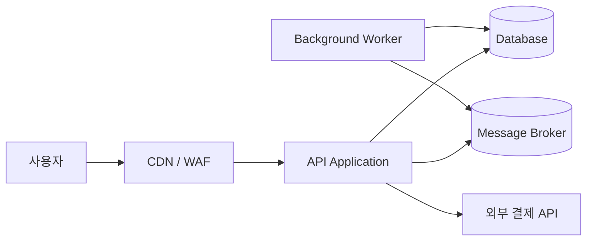
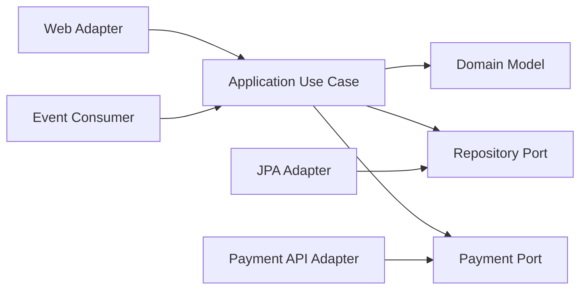

# 소프트웨어 설계 프로세스

소프트웨어 설계는 Diagram을 먼저 그리는 작업이 아니다. 해결할 문제와 성공 조건을 합의하고, 중요한 품질 속성과 제약을 찾은 뒤, 그 조건을 만족하는 구조를 선택하고 검증하는 과정이다. 문서는 의사결정을 돕는 수단이며 문서 이름은 조직마다 다를 수 있다.

```text
문제와 범위 → 요구사항 → 품질 속성 → Architecture 결정
          → 위험 검증 → 구현 계획 → 운영 Feedback
```
### 1. SOW / SR / CRS / 과업지시서
이들 문서는 프로젝트의 계획, 실행, 관리에 중요한 역할을 합니다. 각각의 문서가 다루는 내용과 목적은 다음과 같습니다.
- **SOW (Statement of Work):**
    - **목적:** 프로젝트의 전체 범위, 목표, 산출물, 일정, 그리고 성과 기준 등을 명확하게 정의하여, 클라이언트와 공급자 간의 기대치를 일치시키는 역할을 합니다.
    - **주요 내용:**
        - 프로젝트 개요 및 배경
        - 작업 범위와 구체적인 산출물
        - 수행 방법 및 절차
        - 일정 및 마일스톤
        - 역할과 책임, 성과 기준 및 검수 방법
        - 계약 조건 및 관리 체계
- **SR (Service Request / System Requirements):**
    - **목적:** 프로젝트 수행 중 필요하거나 발생한 특정 서비스나 기능에 대한 요청 사항을 문서화합니다.
    - **주요 내용:**
        - 요청 배경 및 필요성
        - 요청 내용(예: 기능 개선, 신규 기능 추가 등)
        - 기대 결과 및 효과
        - 우선순위와 일정
        - 관련 부서 및 책임자
    > ※ 일부 조직에서는 “SR”이 시스템 또는 소프트웨어 요구사항의 축약어로 사용되기도 하며, 문맥에 따라 다르게 해석될 수 있습니다.

- **CRS (Customer/Client Requirement Specification):**
    - **목적:** 고객 또는 클라이언트의 요구사항을 체계적으로 정리한 문서로, 프로젝트가 충족해야 할 기능적, 비기능적 요구사항을 상세히 기술합니다.
    - **주요 내용:**
        - 고객의 비즈니스 목표 및 문제점
        - 요구되는 기능(예: 사용자 인터페이스, 데이터 처리 등)
        - 성능, 보안, 사용성 등 비기능적 요구사항
        - 제약 사항 및 우선순위
        - 검증 및 승인 기준

- **과업지시서:**
    - **목적:** 현장에서 작업을 수행할 담당자에게 구체적이고 실질적인 업무 지시를 내리기 위한 문서입니다.
    - **주요 내용:**
        - 수행해야 할 작업의 세부 설명
        - 작업 순서 및 절차
        - 필요한 자원(인력, 장비, 도구 등)
        - 일정 및 마감 기한
        - 업무 완료 후 보고 및 검증 방법

이처럼 SOW, SR, CRS, 그리고 과업지시서는 프로젝트의 초기 기획부터 실행 단계까지 각기 다른 측면에서 요구사항과 작업 범위를 명확히 하여 프로젝트 성공의 기반을 마련합니다.

---
### 2. SRS (Software Requirements Specification)

- **목적:** SRS는 소프트웨어 개발 프로젝트에서 필수적인 문서로, 개발될 소프트웨어의 기능과 성능, 제약 조건 등을 상세히 명시하여 개발자와 고객 간의 이해를 돕습니다.
- **주요 내용:**
    - **기능 요구사항:** 소프트웨어가 수행해야 할 기능과 서비스(예: 데이터 입력, 처리, 출력 등)를 상세하게 기술합니다.
    - **비기능 요구사항:** 성능, 보안, 확장성, 사용성, 신뢰성 등 시스템의 전반적인 특성을 규정합니다.
    - **시스템 인터페이스:** 외부 시스템, 사용자 인터페이스, 하드웨어 및 소프트웨어 모듈 간의 상호작용 방식을 설명합니다.
    - **제약 조건:** 기술적, 환경적, 법적 제약사항 및 시스템 구현에 영향을 미치는 요소들을 명시합니다.
    - **검증 및 승인 기준:** 소프트웨어가 요구사항을 충족하는지 확인할 수 있는 방법과 절차를 기술합니다.

SRS 문서는 프로젝트의 개발, 테스트, 유지보수 전 과정에서 기준 문서로 활용되어, 모든 이해관계자가 동일한 목표를 공유할 수 있도록 도와줍니다.

---
### 3. WBS / Gantt
- **WBS (Work Breakdown Structure):**
    - **목적:** 프로젝트 전체 작업을 계층적으로 분해하여 관리 가능한 작업 단위(작업 패키지)로 나누는 도구입니다.
    - **주요 내용 및 장점:**
        - **계층적 구조:** 상위 단계의 큰 작업을 하위 단계의 세부 작업으로 분해하여 체계적으로 관리할 수 있습니다.
        - **업무 분담:** 각 작업 패키지에 책임자를 할당하여 효율적으로 작업을 분배합니다.
        - **진행 관리:** 전체 프로젝트의 진행 상황을 쉽게 파악하고 통제할 수 있습니다.
- **Gantt 차트:**
    - **목적:** 프로젝트 일정 및 진행 상황을 시각적으로 표현하는 도구로, 작업 간의 관계와 기간을 한눈에 볼 수 있습니다.
    - **주요 내용 및 장점:**
        - **시간 관리:** 각 작업의 시작일과 종료일, 지속 시간을 명확하게 표시하여 일정 관리를 용이하게 합니다.
        - **의존 관계:** 작업 간의 선후 관계(종속성)를 표시하여, 지연 시 전체 일정에 미치는 영향을 예측할 수 있습니다.
        - **진척도 관리:** 진행 상황을 업데이트함으로써 프로젝트의 상태를 실시간으로 확인할 수 있습니다.

WBS와 Gantt 차트는 함께 사용되어, 프로젝트를 체계적으로 분해하고, 각 작업의 일정 및 의존 관계를 효과적으로 관리할 수 있게 합니다.

---
### 4. Issue Tracker
- **목적:** Issue Tracker는 프로젝트 진행 중 발생하는 버그, 개선 요청, 문의사항 등 다양한 이슈를 기록, 추적, 관리하는 도구입니다.
- **주요 기능 및 장점:**
    - **이슈 등록 및 분류:** 문제의 종류(버그, 기능 개선, 일반 문의 등)에 따라 이슈를 분류하고, 세부사항을 기록합니다.
    - **우선순위 및 상태 관리:** 각 이슈의 심각도와 우선순위를 지정하고, 현재 상태(예: 신규, 진행 중, 해결됨 등)를 관리합니다.
    - **책임자 할당:** 이슈에 대한 책임자를 지정하여, 해결 과정이 원활하게 진행될 수 있도록 합니다.
    - **이력 관리:** 이슈 해결 과정에서의 변경 사항 및 커뮤니케이션 기록을 남겨, 나중에 참고할 수 있도록 합니다.
    - **협업 도구 연동:** 이메일 알림, 채팅 도구, 버전 관리 시스템 등과 연동되어 팀 내 협업을 지원합니다.

Issue Tracker는 프로젝트 관리 및 소프트웨어 개발의 중요한 도구로, 문제를 신속하게 파악하고 해결하는 데 큰 역할을 합니다.

## System Architecture Diagram

System Architecture Diagram은 Software 밖의 사용자, 외부 시스템, Network 경계와 실행 환경까지 포함해 전체 System의 관계를 보여 준다. “어떤 Server가 몇 대인가”보다 신뢰 경계와 통신 방향을 먼저 드러낸다.



Diagram에는 독자가 판단에 필요한 수준만 표시한다.

- System과 외부 Actor의 경계
- 동기·비동기 통신과 Protocol
- Trust Zone, Internet 공개 지점과 인증 경계
- Stateful Component와 데이터 소유권
- 장애 전파 경로와 단일 장애점
- Region, Availability Zone과 복제 관계

모든 Pod 이름과 Port를 한 Diagram에 넣으면 핵심 관계가 보이지 않는다. Context, Container, Component, Deployment 관점처럼 Level을 나누어 표현한다.


## Software Architecture Diagram

Software Architecture Diagram은 Application 내부 Module과 책임, Dependency 방향을 보여 준다. Directory Tree를 그대로 그리는 것이 아니라 변경 이유와 경계를 설명해야 한다.



Hexagonal Architecture 예시에서는 외부 Adapter가 안쪽 Port를 구현하고, 업무 규칙은 Framework와 Database 구현에 직접 의존하지 않는다. 화살표가 Runtime 호출 방향인지 Source Code Dependency 방향인지 Legend에 명시한다.

## 요구사항을 검증 가능한 문장으로 바꾸기

“빠르고 안정적이어야 한다”는 설계 기준이 되기 어렵다. 품질 속성은 자극, 환경, 대상, 반응과 측정값을 포함해 Scenario로 만든다.

```text
평상시 500 RPS에서 주문 조회 요청의 p95는 200ms 이하이고
오류율은 0.1% 미만이어야 한다.

단일 Availability Zone 장애 시 5분 안에 자동 복구하고
확정 주문 데이터 손실은 없어야 한다.
```

성능, 가용성, 보안, 변경 용이성은 서로 Trade-off를 만든다. 모든 속성을 최고 수준으로 달성하려 하지 말고 업무 위험과 비용에 따라 우선순위를 정한다.

## 핵심 설계 순서

1. System Context와 Scope를 정한다.
2. 기능 요구사항과 비기능 품질 Scenario를 작성한다.
3. 데이터 소유권, 일관성, 보존과 개인정보 등급을 정한다.
4. Module·Service 경계와 Dependency 방향을 선택한다.
5. API, Event Schema와 실패 계약을 정의한다.
6. 배포 Topology, Resource, Scaling과 장애 복구를 설계한다.
7. 가장 위험한 가정을 Prototype, 부하 Test와 장애 주입으로 검증한다.
8. 결정과 근거를 ADR로 남기고 운영 지표로 다시 평가한다.

## ADR로 결정의 이유 남기기

Architecture Decision Record는 결과보다 당시의 맥락과 Trade-off를 보존한다.

```markdown
# 주문 생성에 Transactional Outbox 사용

## Context
Database Commit과 Message 발행 사이의 유실을 막아야 한다.

## Decision
같은 Transaction에 Outbox Row를 저장하고 Relay가 발행한다.

## Consequences
발행 지연과 중복 가능성이 생기므로 Consumer Idempotency가 필요하다.
```

결정이 바뀌면 기존 ADR을 지우지 않고 새 ADR에서 대체 관계를 남긴다. 그래야 과거 제약과 현재 선택의 이유를 추적할 수 있다.

## 설계 완료의 기준

- 핵심 Use Case와 실패 Scenario가 Diagram과 Interface에 반영되었다.
- 데이터 정합성, Retry, Timeout과 Idempotency 정책이 명시되었다.
- 보안 경계와 Secret·권한 관리가 포함되었다.
- SLO, Log, Metric, Trace와 Alert가 설계에 포함되었다.
- Capacity 가정과 Resource 산정 근거가 있다.
- Migration, Rollback, Backup과 Restore 절차를 검증했다.
- 알려진 위험과 의도적으로 미룬 결정이 기록되어 있다.

좋은 설계 문서는 구현 전에 모든 것을 예언하지 않는다. 중요한 가정을 드러내고, 구현과 운영에서 틀렸음을 빠르게 발견하며, 안전하게 변경할 수 있게 만든다.

# Reference
[C4 Model](https://c4model.com/)
[AWS Well-Architected Framework](https://docs.aws.amazon.com/wellarchitected/latest/framework/welcome.html)
[Architecture Decision Records](https://adr.github.io/)
